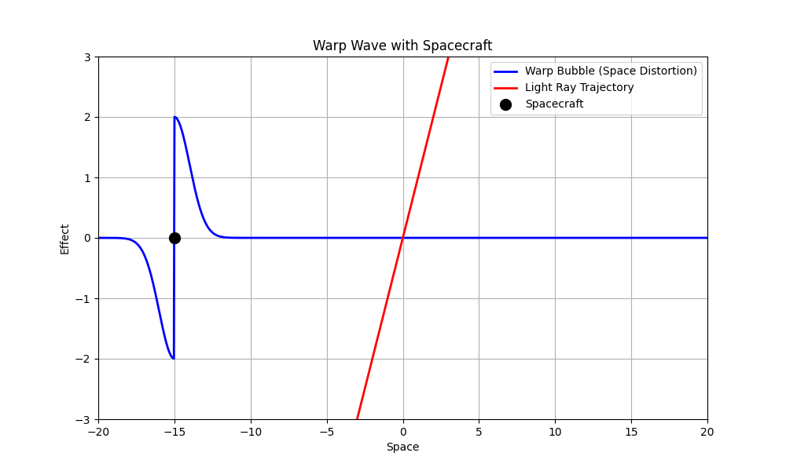

# Warp Drive in a Nutshell

The concept of a warp drive—a theoretical propulsion system that allows faster-than-light travel—was first mathematically formalized by physicist Miguel Alcubierre in 1994. Inspired by the idea of bending space-time, Alcubierre proposed a solution within the framework of Einstein's general relativity that could, in theory, enable interstellar travel without violating the laws of physics. Here's how it works:

---

## **Space Contracts in Front**

- In front of the bubble, space **squeezes together**, bringing distant stars and planets closer to you. It’s like scrunching up a piece of paper to bring two points closer.

---

## **Space Expands Behind**

- Behind the bubble, space **stretches out**, pushing your starting point farther away. It’s like stretching a rubber band to make one end move away.

---

## **You Stay Still**

- Inside the bubble, space-time is flat, so you feel no acceleration or forces. You’re just chilling while space itself does all the work.

---

## **Faster-Than-Light Travel**

- Because space is moving around you, you can effectively travel **faster than light** without breaking any laws of physics (locally). From the outside, it looks like you’re zooming past stars at incredible speeds, but from your perspective, you’re just sitting still.

---

## **The Energy Challenge**

Creating a warp bubble requires **huge amounts of energy**, thanks to Einstein’s famous equation, **$$E = mc^2$$**. This tells us that energy and mass are interchangeable, and warping space-time would need energy equivalent to the mass of entire planets or even stars

---

## **Exotic Matter**

- Scientists speculate that something called **exotic matter** (with negative mass or energy) might be needed to create the warp bubble.
This exotic matter would bend space-time in the right way, but we haven’t found any yet.

---

## **Potential Energy Sources**

- If we could harness the energy of **antimatter**, **black holes**, or even **dark energy**, we might one day power a warp drive. For now, these are just ideas, but they inspire us to push the boundaries of science and technology.

---

## **What the Simulation Shows**

- The **blue curve** represents the warp bubble, showing how space contracts in front and expands behind.
- The **black dot** is your spacecraft, sitting safely inside the bubble.
- The **red curve** shows how light rays bend as they pass through the warped space-time.

---

## **Why It’s Cool**

- This isn’t science fiction—it’s based on real physics (Einstein’s general relativity)!
- While we don’t yet have the technology to build a warp drive, the idea inspires scientists to explore the boundaries of space, time, and the universe.
In short: **You’re not moving through space—space is moving around you!** But to make it happen, we’ll need to unlock the secrets of energy and matter. 🚀✨

---

## Simulation Scripts

Two Python scripts are provided to visualise warp drive concepts.
Both are **1D** (spatial coordinate \(x\)) and use **heuristic** or **simplified** versions of the Alcubierre metric. They are **not** full general‑relativistic solvers, but offer intuitive, animated insights.

## Common simplifications & limits (both scripts)

- **1D spatial dimension** – only motion along $\(x\)$. Transverse effects (e.g., tidal forces) are ignored.
- **No time evolution of the metric** – the bubble shape moves rigidly; back‑reaction on the metric is neglected.
- **Newton‑like visualisation** – the “shape function” $\(f(x,t)\)$ is plotted as a curve, but in real GR it is a component of the metric.
- **No energy conditions** – we do not check whether the required negative energy density violates quantum inequalities.
- **Flat space outside the bubble** – the Alcubierre metric is asymptotically flat, but the plots only show the immediate region.
- **Non‑relativistic light bending** – true null geodesics are replaced by heuristic ray dragging.
- **Precomputed histories** – the spacetime diagrams are static after precomputation; the animation only scans through them.
Despite these limits, the scripts correctly capture the **kinematic signatures** of a warp drive:
contraction in front, expansion behind, shift vector, and negative energy density proportional to $\((\partial f/\partial x)^2\)$.

---

## `warp.py` – qualitative demonstrator

**What it is:**
A **pedagogical, artistic** visualisation. It uses a **Gaussian‑like bubble** with separate contraction and expansion strengths, plus a trailing wake. The light rays are bent by a **non‑linear sine function** of the warp field.

- Shape function (heuristic):
- Light bending (non‑physical, illustrative):
$$x_{\text{ray}} = x + K \sin\bigl(f_{\text{simple}}(x,x_0)\bigr)$$
- No spacetime diagrams, only a single animated panel.
**What it is NOT:**
- Not based on the exact Alcubierre shape function $\(\tanh\)$ form.
- Does **not** implement the correct expansion scalar $\(\theta\)$ or energy density.
- The light bending has **no physical justification** (it is not derived from the shift vector).
- Contraction/expansion are **hard‑coded** to left/right of the bubble centre, independent of velocity direction.
- No shift vector $\(\beta\)$, no exotic energy visualisation.
**Best for:** First exposure to warp drive concepts, classroom demonstrations, or generating simple GIFs.

---

## `warp_ng.py` – physically improved version

**What it is:**
A **more accurate** visualisation combining **1D Alcubierre quantities** with a **2D illustrative coordinate grid distortion**. It follows the original Alcubierre metric ansatz as closely as possible in a toy model.

- Shape function uses the **tanh‑based** Alcubierre form:
$$f(r_s) = \frac{\tanh\bigl(\sigma(r_s + R)\bigr) - \tanh\bigl(\sigma(r_s - R)\bigr)}{2\tanh(\sigma R)}$$
  where $r_s = \sqrt{(x-x_0)^2 + y^2 + z^2}$.
- **Shift vector** $\(\beta^x \approx -v_s f(r_s)\)$ is computed and visualised.
- **Expansion scalar** $\(\theta \approx v_s \frac{\partial f}{\partial x}\)$ (on-axis) and an **effective energy proxy** $T_{00}$ (evaluated at torus radius $\rho = R$) are shown in spacetime diagrams.
- **2D coordinate grid distortion** panel shows how spatial coordinates are deformed by the shift field in the $(y,z)$ plane.
- Four-panel layout:
  1. Top-left: Bubble profile $f$, shift field $\beta$, light-ray dragging.
  2. Top-right: 2D illustrative grid distortion with moving bubble.
  3. Middle: Spacetime diagram of expansion scalar $\theta$.
  4. Bottom: Spacetime diagram of exotic energy proxy $T_{00}$.
- Light dragging implemented as:
$$x_{\text{ray}} = x + K \, V_s f(r_s)$$
**What it is NOT:**
- Still **not a full 4D GR simulation** – transverse dimensions are only visualised illustratively.
- The 2D grid is a **coordinate visualisation** of the shift field, not a physical embedding or solution of the full metric.
- Light rays are **heuristic** (shifted by the shift vector), not true null geodesics.
- Precomputed diagrams assume a rigidly moving bubble; no dynamic back-reaction.
- Colour scaling is normalised for visibility.
**Best for:** Understanding the link between the Alcubierre shape function, shift vector, expansion/contraction, negative energy, and visual coordinate distortion.
Further reading
You can view the paper on the official
[IOPscience Journal Page](https://iopscience.iop.org/article/10.1088/0264-9381/11/5/001),
access it via its
[DOI](https://doi.org/10.1088/0264-9381/11/5/001),
or read the freely available
[arXiv preprint](https://arxiv.org/abs/gr-qc/0009013).
Alcubierre, M. (1994). *The Warp Drive: Hyper-Fast Travel Within General Relativity*. Classical and Quantum Gravity, 11(5), L73–L77.
DOI: <https://doi.org/10.1088/0264-9381/11/5/001>
arXiv: <https://arxiv.org/abs/gr-qc/0009013>

---
Alcubierre, M., & Lobo, F. S. N. (2017). *Warp Drive Basics*. In *Wormholes, Warp Drives and Energy Conditions* (pp. 1–26). Springer.
DOI: <https://doi.org/10.1007/978-3-319-55182-1_11>
Springer: <https://link.springer.com/chapter/10.1007/978-3-319-55182-1_11>
arXiv: <https://arxiv.org/abs/2103.05610>
