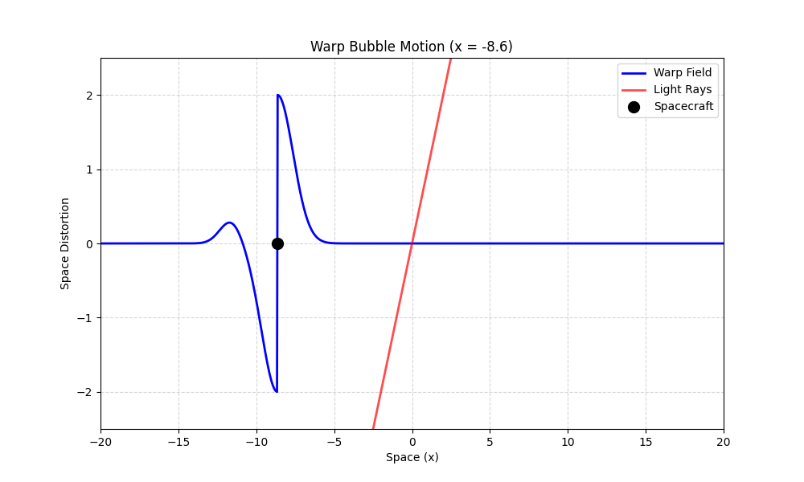

# Warp Drive in a Nutshell

Imagine you're on a spacecraft, and instead of zooming through space like a rocket, you’re sitting inside a **warp bubble**. This bubble is like a magic carpet that **warps space-time** around you. Here’s how it works:

---

## **Space Contracts in Front**

- In front of the bubble, space **squeezes together**, bringing distant stars and planets closer to you. It’s like scrunching up a piece of paper to bring two points closer.

---

## **Space Expands Behind**

- Behind the bubble, space **stretches out**, pushing your starting point farther away. It’s like stretching a rubber band to make one end move away.

---

## **You Stay Still**

- Inside the bubble, space-time is flat, so you feel no acceleration or forces. You’re just chilling while space itself does all the work.

---

## **Faster-Than-Light Travel**

- Because space is moving around you, you can effectively travel **faster than light** without breaking any laws of physics (locally). From the outside, it looks like you’re zooming past stars at incredible speeds, but from your perspective, you’re just sitting still.

---

# **The Energy Challenge**

Creating a warp bubble requires **huge amounts of energy**, thanks to Einstein’s famous equation, **$$E = mc^2$$**. This tells us that energy and mass are interchangeable, and warping space-time would need energy equivalent to the mass of entire planets or even stars!

---

## **Exotic Matter**

- Scientists speculate that something called **exotic matter** (with negative mass or energy) might be needed to create the warp bubble. This exotic matter would bend space-time in the right way, but we haven’t found any yet.

---

## **Potential Energy Sources**

- If we could harness the energy of **antimatter**, **black holes**, or even **dark energy**, we might one day power a warp drive. For now, these are just ideas, but they inspire us to push the boundaries of science and technology.

---

# **What the Simulation Shows**

- The **blue curve** represents the warp bubble, showing how space contracts in front and expands behind.
- The **black dot** is your spacecraft, sitting safely inside the bubble.
- The **red curve** shows how light rays bend as they pass through the warped space-time.

---

# **Why It’s Cool**

- This isn’t science fiction—it’s based on real physics (Einstein’s general relativity)!
- While we don’t yet have the technology to build a warp drive, the idea inspires scientists to explore the boundaries of space, time, and the universe.

---

In short: **You’re not moving through space—space is moving around you!** But to make it happen, we’ll need to unlock the secrets of energy and matter. 🚀✨

---
